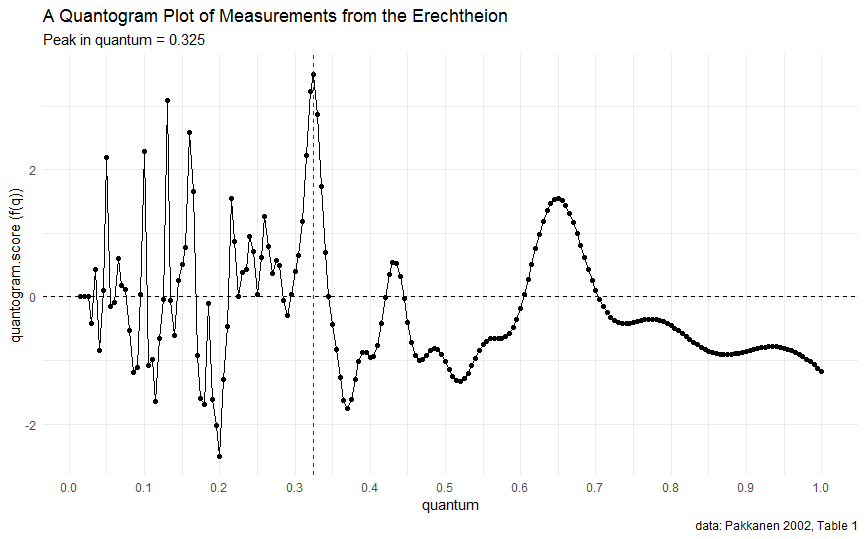

<!-- badges: start -->
[](https://CRAN.R-project.org/package=quantatools)
[](https://github.com/lsteinmann/quantatools/actions/workflows/R-CMD-check.yaml)
[](https://codecov.io/gh/lsteinmann/quantatools?branch=update)

[](https://zenodo.org/badge/latestdoi/140330551)
[](http://dx.doi.org/10.15496/publikation-43229)
<!-- badges: end -->


quantatools
===========

This package facilitates the analysis of quantum in archaeological data with cosine quantogram and related statistical methods. The main function is the implementation of Kendalls cosine quantogram in R. It is used to identify e.g. the base measurement that was used when generating a sequence of lengths, which can be helpful for archaeologists and architects working with building measurements or volumes looking to find the unit-variation that was used in the making of specific artifact groups. The package is suited to gather any base measurement of a number of measurements and is of course not restricted to these use cases. 

The package was developed by [Maciej Kasiński](https://github.com/maciejkasinski/quantatools) and its methods have been presented together with A. Kubicka in [an article in 2017](http://dx.doi.org/10.15496/publikation-43229). This version of quantatools has been reduced to the base functionality (compared to the [original repository](https://github.com/maciejkasinski/quantatools)) in order to ease documentation, maintainability and publication on CRAN. 

Literature and other References
------------

* A. Kubicka – M. Kasiński, The Metrological Research of Machu Picchu Settlement: Application of a Cosine Quantogram Method for 3D Laser Data, in: J.B. Glover – J. Moss – D. Rissolo (Hrsg.), Digital Archaeologies, Material Worlds (Past and Present). Proceedings of the 45th Annual Conference on Computer Applications and Quantitative Methods in Archaeology (Tübingen 2020)
* D. G. Kendall, Hunting Quanta, Philosophical Transactions of the Royal Society of London. Mathematical and Physical Sciences A 276, 1974, 231--266, doi: 10.15496/publikation-43229
* J. Pakkanen, Deriving Ancient Foot Units from Building Dimensions: a Statistical Approach Employing Cosine Quantogram Analysis, 2002, doi: 10.15496/PUBLIKATION-3389 


Installation
------------

Quantatools is not yet on CRAN. You can install the original version of quantatools from GitHub with:

``` r
devtools::install_github("maciejkasinski/quantatools", dependencies = FALSE)
```

or (currently) this version using:

``` r
devtools::install_github("lsteinmann/quantatools", build_vignettes = TRUE)
```


Example
------------

``` r
library(dplyr)
library(quantatools)
calculate_quantogram(Erechtheion$Measurement_m) %>%
  plot_quantogram(title = "A Quantogram Plot of Measurements from the Erechtheion",
                  caption = "data: Pakkanen 2002, Table 1")
```




